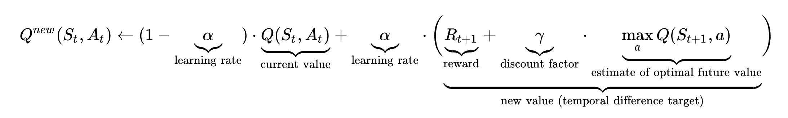

# Lab 10 - Tic Tac Toe
## Solution made by Tilocca Salvatore s305938 and Natale Davide s318967 
In this laboratory we tried to implement a Q-learning algorithm in order to train a Tic Tac Toe agent.
We used a dictionary in which we associated at each state another dictionary containing  all possible next action with their state-action value. 

At each step we make two random agent play a game, given the current state we choose a new action randomly and add it to the current state to generate the next state, then we assign a reward to the next state and we update the state-action value of the current state according to the Q-learning formula:

The rewards are:
- `1` in case of winning game
- `0.75` if the agent blocks adversarial win
- `0.5` if the agent creates a trap condition

the same rewards but negative for the opponent.

We also tried to manage simmetry of Tic Tac Toe by creating the CustomState class, in this class we implemented the `unique_representation` function, which returns the unique representation of a given state. In particular, we considered all simmetrical variant of magic board, so given a state the function generate all possible state's representations in the magic boards, then these representations are sorted according to the `compare` function, the unique representation is the firt element in this sorted list, which is used as key inside the dictionary of Q-lerning algorithm.

In this way, we reduced the number of states inside the dictionary from 5k elements to abount 800 elements.

## Experiments
We made some experiments testing 9 different combinations for learing rate and discount factory values. To test performance we made our agent play against a random agent, in particular it performs 100 games as Player 1 and 100 games as Player 2, then the results are combined together to calculate the win rate.

We show the results in the table below:

|Learning rate|Discount factor|Steps|Win rate|
|:---:|:---:|:---:|:---:|
|0.1|0.5|500000|69.50%|
|0.1|0.7|500000|80.50%|
|0.1|0.9|500000|68.00%|
|0.5|0.5|500000|67.50%|
|0.5|0.7|500000|65.00%|
|0.5|0.9|500000|79.00%|
|0.9|0.5|500000|`82.00%`|
|0.9|0.7|500000|76.00%|
|0.9|0.9|500000|65.50%|

# Review Done
Review do to [Porcheddu Massimo] (https://github.com/TheMassimo/Computational_intelligence/issues/6) and [Incaviglia Salvatore](https://github.com/SalvatorePolito98/Computational_Intelligence24/issues/4)
